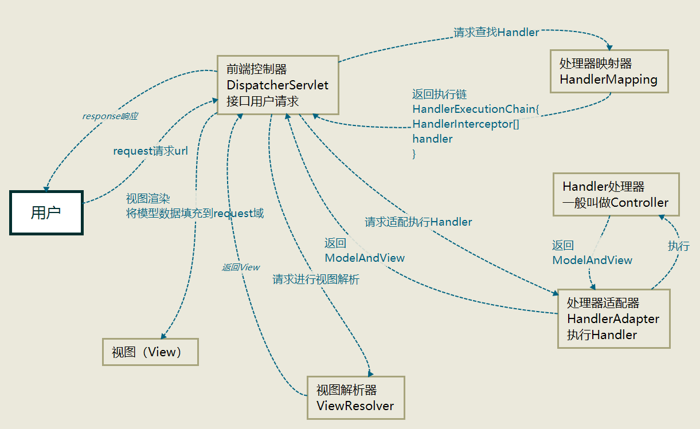

##SpringMVC

####Spring 框架的 7 个模块

####SpringMVC是什么？
>Spring Web MVC是一种基于Java的实现了Web MVC设计模式的请求驱动类型的轻量级Web框架，即使用了MVC架构模式的思想，将web层进行职责解耦，基于请求驱动指的就是使用请求-响应模型，框架的目的就是帮助我们简化开发。
####SpringMVC运行流程图

#####核心架构的具体流程步骤如下：
- 首先用户发送请求——>DispatcherServlet，前端控制器收到请求后自己不进行处理，而是委托给其他的解析器进行处理，作为统一访问点，进行全局的流程控制；
- DispatcherServlet——>HandlerMapping， HandlerMapping将会把请求映射为HandlerExecutionChain对象（包含一个Handler处理器（页面控制器）对象、多个HandlerInterceptor拦截器）对象，通过这种策略模式，很容易添加新的映射策略；
- DispatcherServlet——>HandlerAdapter，HandlerAdapter将会把处理器包装为适配器，从而支持多种类型的处理器，即适配器设计模式的应用，从而很容易支持很多类型的处理器；
- HandlerAdapter——>处理器功能处理方法的调用，HandlerAdapter将会根据适配的结果调用真正的处理器的功能处理方法，完成功能处理；并返回一个ModelAndView对象（包含模型数据、逻辑视图名）；
- ModelAndView的逻辑视图名——> ViewResolver， ViewResolver将把逻辑视图名解析为具体的View，通过这种策略模式，很容易更换其他视图技术；
- View——>渲染，View会根据传进来的Model模型数据进行渲染，此处的Model实际是一个Map数据结构，因此很容易支持其他视图技术；
- 返回控制权给DispatcherServlet，由DispatcherServlet返回响应给用户，到此一个流程结束。

####Spring MVC优势
- 清晰的角色划分
  - 前端控制器（DispatcherServlet）
  - 请求到处理器映射（HandlerMapping）
  - 处理器适配器（HandlerAdapter）
  - 视图解析器（ViewResolver）
  - 处理器或页面控制器（Controller）
  - 验证器（Validator）
  - 命令对象（Command  请求参数绑定到的对象就叫命令对象）
  - 表单对象（Form Object 提供给表单展示和提交到的对象就叫表单对象）
- 分工明确，而且扩展点相当灵活，可以很容易扩展
- 由于命令对象就是一个POJO，无需继承框架特定API，可以使用命令对象直接作为业务对象
- 和Spring 其他框架无缝集成，是其它Web框架所不具备的
- 可适配，通过HandlerAdapter可以支持任意的类作为处理器
- 可定制性，HandlerMapping、ViewResolver等能够非常简单的定制
- 功能强大的数据验证、格式化、绑定机制
- 利用Spring提供的Mock对象能够非常简单的进行Web层单元测试
